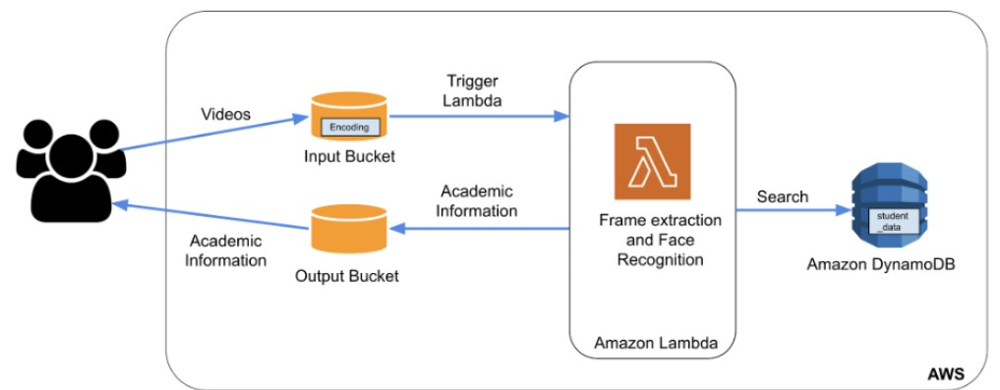

# Elastic Web Application for Video Processing and Facial Recognition

## Overview
This project aims to create an elastic web application that uses AWS as a PaaS cloud service to scale automatically based on demand. This application can process videos, perform face recognition, categorize them and subsequently output relevant data regarding the identified individuals from an Amazon DynamoDB database. 

This solution is designed to effectively handle concurrent user requests without relying on a single server. Instead, it utilizes AWS cloud resources to provide a robust and scalable image recognition solution. 

---

## Architecture

Our architecture utilizes various AWS services, each contributing unique functionality:

1. **AWS Lambda**: The backbone of our solution, Lambda allows us to run our entire code as a serverless, event-driven service, eliminating the need to manage servers. The creation of an Input Bucket object triggers the Lambda function.

2. **AWS S3**: S3 buckets store our input and output data. Input data comprises videos, while the output data includes relevant academic information.

3. **AWS ECR**: The Elastic Container Repository stores our Docker image used to launch the AWS Lambda service.

4. **Amazon DynamoDB**: This NoSQL database stores academic information related to the identified person in a key-value format.

5. **Amazon Cloudwatch**: This service monitors logs generated by various AWS services, assisting in the development and debugging process.

---

## Auto-Scaling
To manage incoming requests efficiently, we use AWS Lambda's inherent auto-scaling feature. Each function runs as a separate process in its environment, with a default limit of 1000 concurrent Lambda functions. Therefore, as the request load increases, AWS Lambda automatically scales to accommodate these requests by creating additional instances of the function.

---

## Project Structure

Here are the main files in our project and a brief description of each:

- `handler.py`: Contains the AWS Lambda function's code, responsible for downloading input videos, performing facial recognition, querying DynamoDB, and uploading results to the output bucket.

- `Dockerfile`: Contains scripts for installing necessary packages for the function to run. The built image is used by the AWS Lambda function.

- `student_data.json`: Contains academic records data of different individuals, used to pre-populate the database.

- `encoding`: Contains the trained deep learning model which the handler.py uses to classify the images extracted from the input video.

- `entry.sh`: This shell script invokes the “handler.face_recognition_handler” function in the lambda environment when it's triggered.

---

## How to Run

1. Install Python.
2. Install boto3 and awscli packages and configure your AWS environment.
3. Open the `workload.py` file and change the input and output bucket variables to your bucket names.
4. Run the `workload.py` file to upload videos to the input bucket. This action will trigger the AWS Lambda function to execute.
5. Open the output bucket in AWS S3 to find the generated academic records.
